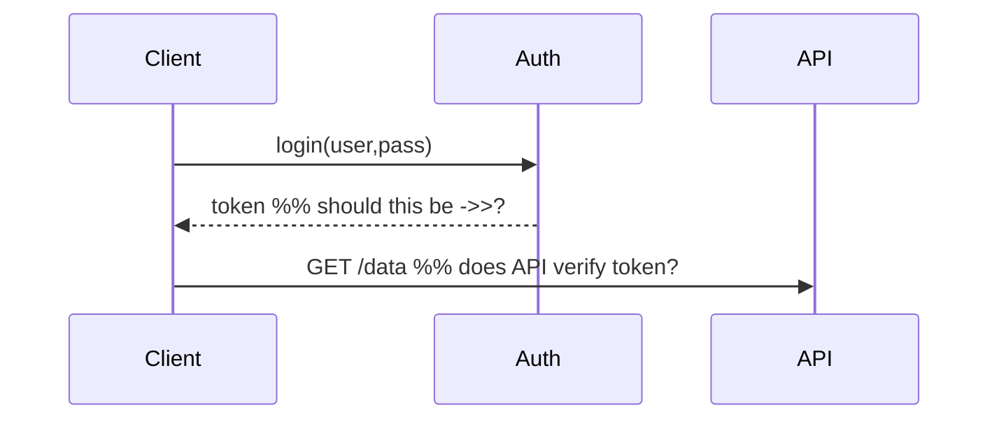

<p align="center">
  <a href="https://github.com/txt/guru26spr/blob/main/README.md"></a>
  <a href="https://github.com/txt/guru26spr/blob/main/docs/lect/syllabus.md"></a>
  <a href="https://docs.google.com/spreadsheets/d/1xZfIwkmu6hTJjXico1zIzklt1Tl9-L9j9uHrix9KToU/edit?usp=sharing"></a>
  <a href="https://moodle-courses2527.wolfware.ncsu.edu/course/view.php?id=8119"></a>
  <a href="https://discord.gg/vCCXMfzQ"></a>
  <a href="https://github.com/txt/guru26spr/blob/main/LICENSE.md"></a></p>
<h1 align="center">:cyclone: CSC491/591: How to be a SE Guru <br>NC State, Spring '26</h1>
 

.

# Code Review: From Inspections to Everything Review

---


Q: **Has AI Replaced Code Review?**

A: No. Quite the opposite.

A reasonable expectation was that LLMs would reduce the
need for human review. Generate better code, catch more
bugs automatically, close the loop without the meeting.

Wrong!

AI has *multiplied* the volume of code that needs reviewing.
A developer who once wrote 200 lines a day now ships 2,000.
The bottleneck has shifted: writing is no longer the hard
part. Reading, understanding, and trusting what gets merged
is. Manual review — careful, human, contextual — is now
the majority activity in a working software engineer's day.
At Google, developers already spent ~3 hours/day on review
before LLMs. That number is going up, not down.

There is a deeper problem. LLM-generated code is fluent and
plausible. It looks right. It compiles. It passes the tests
you thought to write. The bugs it introduces are not the
obvious kind — they are the subtle kind, the kind that only
show up when someone who understands the system reads the
code and asks "wait, why?" That person is you. That process
is review. If anything, the age of AI has made code review
the core competency of professional software engineering —
not a courtesy, not a compliance checkbox, but the primary
mechanism by which teams maintain shared understanding of
systems that are now being written faster than any
individual can track.

<br clear=all>

## 0. Hook: Is It Even "Code" Review? 

Before we look at history, a provocation.

Open a typical pull request on GitHub. What's in it?

**`.py` source code** — the thing we actually call "code":
```python
def retry(fn, n=3):
    for i in range(n):        # off by one? should be n+1?
        try: return fn()
        except: pass
```

**`.yaml` CI/CD config** — wrong indent silently skips jobs:
```yaml
jobs:
  test:
    runs-on: ubuntu-latest
    steps:
      - uses: actions/checkout@v3
      - run: pytest
  deploy:          # reviewer must check: does this gate on
    runs-on: ubuntu-latest   # test passing? no `needs:` here
    steps:
      - run: ./deploy.sh
```

**`.mermaid` UML diagram** — wrong arrow breaks the design:
```
sequenceDiagram
    Client->>Auth: login(user,pass)
    Auth-->>Client: token          %% should this be ->>?
    Client->>API: GET /data        %% does API verify token?
```



**`.md` documentation** — wrong claim misleads everyone who
reads it for the next two years:
```markdown
## Authentication
All endpoints require a Bearer token **except** `/health`.
<!-- reviewer: /metrics also skips auth — this is wrong -->
```

GitHub's diff tool treats all of these identically. You can
comment on any line of any file. The review tooling doesn't
care whether the artifact is "code."


**So why do we call it "code review"?**

Because when the practice was invented, repos *only* contained
source code. The name is a historical accident. What we
actually do today is **artifact review** — or more precisely,
**change review**: we review diffs, regardless of file type.

This matters because:

1. A bad YAML config can take down production as fast as a
   logic bug.
2. A wrong arrow in a Mermaid diagram misleads the next
   ten developers.
3. LLMs hallucinate in YAML and Markdown just as badly as
   in Python — but we have almost no research on reviewing
   those artifacts.

Keep this in the back of your mind all lecture. Every time
someone says "code review," mentally substitute
"change review."

---

## 1. Pre-Rigby: The Formal Inspection Era 

### Fagan 1976

Michael Fagan at IBM published "Design and Code Inspections
to Reduce Errors in Program Development" in 1976. This is
the origin of the practice.

Fagan inspections were **heavyweight**:

- Scheduled in-person meetings
- Defined roles: moderator, reader, inspector, author
- Checklists reviewed before the meeting
- Formal defect logging and re-inspection cycles
- Exit criteria before you could proceed

Results were impressive. Studies reported ~60% defect
detection rates. But the process was expensive: preparation
time, meeting time, follow-up time. It was optimized for
finding bugs and only bugs.

### Shull, Basili et al. 1996: Perspective-Based Reading

Fagan's framework assumed reviewers should look for
*everything*. A body of research in the 1990s asked a
sharper question: what if each reviewer looks for something
*specific*?

Basili, Shull, and colleagues at the University of Maryland
developed **Perspective-Based Reading (PBR)**, tested in
a controlled experiment at NASA/Goddard Space Flight Center.

The idea: assign each reviewer a distinct stakeholder
perspective before they read the document:

- **User perspective** — can I accomplish my goals with
  this system?
- **Designer perspective** — is this consistent and
  complete enough to build from?
- **Tester perspective** — can I derive test cases from
  this?

Each perspective comes with a specific set of questions
the reviewer must answer. The reviewer is not free-reading
— they are procedurally guided.

The goal of PBR is to provide operational
scenarios where members of a review team read

---

## 2. Rigby 2013: The Convergence Finding 

### The Paper

Peter Rigby and Christian Bird. "Convergent Contemporary
Software Peer Review Practices." ESEC/FSE 2013.

This is one of the most important empirical SE papers of
the last 20 years. Here's why.

Rigby and Bird studied review practices across five very
different projects: Linux kernel, Eclipse, KDE, Apache,
and Microsoft (commercial). Different companies, different
cultures, different tools, different domains.

**They found the same practices everywhere:**

| Practice | Observed Value |
|---|---|
| Reviewers per change | ~2 |
| Change size | small (median ~44 LOC) |
| Review interval | hours, not days |
| Review rounds | 1–2 |
| Focus | understanding, not just bugs |

This convergence was *not* designed. Nobody told Linux and
Microsoft to use two reviewers. They arrived there
independently. That suggests these aren't arbitrary choices
— they're what works.

### The Knowledge Transfer Finding

Rigby and Bird also found something that reframes the whole
purpose of review:

> Code review transformed from a defect-finding task into
> a collaborative problem-solving activity. Programmers'
> understanding of the broader system increased by 60%
> to 150%.

Let that sink in. The *primary* benefit of adding review to
your DevOps pipeline is not bug-finding. It's **knowledge
transfer**. Reviewers learn the codebase. Authors learn
better practices. The team converges on shared standards.

This is why "code review is old-fashioned in the age of AI"
is wrong. An AI cannot transfer knowledge to your team.
An AI cannot build shared ownership. An AI cannot catch
the organizational context that makes a change subtly wrong
even when it's technically correct.

---

## 3. Post-Rigby: Confirming and Deepening 

Three papers worth knowing:

### Bacchelli & Bird, ICSE 2013 (Microsoft)

"Expectations, Outcomes, and Challenges of Modern Code
Review."

They observed, interviewed, and surveyed developers at
Microsoft and manually classified hundreds of review
comments.

Finding: developers say they review to find defects.
But most review comments are actually about:
- code style and readability
- alternative approaches
- knowledge transfer questions
- design concerns

The stated motivation (bugs) and the actual practice
(understanding) diverge. This is consistent with Rigby's
knowledge-transfer result.

### Sadowski et al., ICSE-SEIP 2018 (Google)

"Modern Code Review: A Case Study at Google."

9 million reviewed changes, 12 interviews, 44-respondent
survey. Google has been doing code review since the
company's early days — it is deeply cultural.

Key finding: even after decades of refinement, code review
at Google still has breakdowns — mostly from complexity
of interactions, not from the technical review itself.
Developers spend ~3 hours/day on review.

Also confirms Rigby: median 1 reviewer, small changes,
fast turnaround.

### Czerwonka et al., ICSE 2015 (Microsoft)

"Code Reviews Do Not Find Bugs."

The provocative title gets at something real: formal
defect detection is *not* what modern lightweight review
is optimized for. Static analysis finds bugs. Tests find
bugs. Review finds design problems, knowledge gaps,
style violations, and hidden assumptions.

If you go into review expecting Fagan-style bug hunting,
you will be disappointed and you will do it wrong.

---

## 4. The LLM Era: New Tool, Same Problems 

### What LLMs Can Do

- Generate review comments at scale with no latency
- Catch style violations consistently
- Summarize large PRs
- Flag common error patterns

Industrial experience reports (Ericsson, Google
AutoCommenter, Beko/Qodo) all confirm: LLMs can provide
useful first-pass review, especially for style and obvious
issues. In one study, ~74% of LLM comments were accepted
by developers.

### What LLMs Cannot Do

The Bacchelli/Rigby knowledge-transfer finding bites hard
here. LLMs cannot:

- Transfer organizational knowledge to the reviewer
- Build shared code ownership
- Understand whether a change is *strategically* wrong
  even if technically correct
- Review YAML, Mermaid, and Markdown with any reliability
  (almost no research on this)

### The Benchmark Reality

When you actually measure LLM review quality on structured
benchmarks, current systems underperform significantly.
They do better on functional errors than style. They
hallucinate method names. They generate verbose, generic
comments that don't reflect the actual codebase.

The state of the art: multi-review aggregation (asking
multiple LLMs and combining) boosts F1 by ~44%. Still
not close to a good human reviewer.

### The Trust Problem

Field studies find that developers accept LLM reviews
conditionally:
- High familiarity with the codebase → more skeptical
- Large/risky PR → prefer human review
- False positives erode trust fast

The practical lesson: **LLMs are a pre-filter, not a
replacement.** Use them to catch the obvious stuff so
human reviewers can focus on semantics, design, and
knowledge transfer — the things only humans can do.

### The Open Research Gap

Nobody has studied LLM review of non-source artifacts.
Nobody has asked: is GPT-4 any good at reviewing a
Terraform config, a GitHub Actions workflow, or an OpenAPI
spec? These are exactly the artifacts where (a) human
review is most lax and (b) errors have the most
operational impact.

Your "everything review" framing exposes a real blind spot
in the research literature.

---

## 5. Rahul on Practical Review 

*The following is practitioner wisdom from a working SE,
not from a paper. This is the kind of knowledge that
doesn't get published but matters enormously in practice.*

### PR Size Is the #1 Variable

> PRs > 500 LOC is bad. PRs > ~3k LOC is a fireable
> offense.

Why? Review complexity is:

- **Quadratic** in number of files
- **Quadratic** in number of new functions
- **Linear** in LOC

For every function you add, a reviewer must check how it
interacts with every other function you added, and with
every function in the codebase it calls. Small PRs are
not just polite — they are a prerequisite for review to
actually work.

Real numbers: a 2–3 file / 20–30 LOC PR takes ~5 minutes
to review. A 40–50 file / 1500–2000 LOC PR takes 4–5
hours. Nobody does a good 5-hour review. They skim.

### Stacked PRs

When a large feature must be broken up, use **stacked
PRs**: a sequence of PRs each building on the last.
Reviewers can approve one, some, or all. Graphite
(graphite.com) is a tool that manages this for GitHub.

The rule: **one PR, one clear goal.** A PR does not need
to close a story on your Kanban. It needs to be
reviewable.

### Draft vs. Published

- **Draft PR**: "I'm still working on this."
- **Published PR**: "I believe this is mergeable as-is."

Publishing a PR that isn't ready is disrespectful of
reviewers' time. A published PR is a claim, not a
question. Use drafts while iterating; publish when
you're done.

Most platforms don't run CI on drafts, and don't notify
reviewers. This is by design.

### Style Guides and TLAs

Read the style guide. If you open a PR that violates the
style guide you agreed to follow, you are wasting everyone's
time. Style guides exist so reviewers don't have to
re-litigate the same questions on every PR.

Style guides should be **short and readable** — one page
of rules, one page of examples. See Rahul's Rust style
guide for a concrete example of this done right.

The TLA cheat sheet (these are the shorthand reviewers
use — knowing them is like knowing the vocabulary of the
conversation):

## TLA Cheat Sheet

Shorthand reviewers use — knowing these is knowing the vocabulary.

### The Immortal Classics

| TLA | Meaning | One-liner |
|-----|---------|-----------|
| DRY | Don't Repeat Yourself | same logic in two places = two places to fix |
| KISS | Keep It Simple, Stupid | the clever solution is rarely the good one |
| YAGNI | You Ain't Gonna Need It | don't build for imagined future requirements |

### SOLID

| TLA | Meaning | One-liner |
|-----|---------|-----------|
| SRP | Single Responsibility Principle | one reason to change |
| OCP | Open/Closed Principle | open for extension, closed for modification |
| LSP | Liskov Substitution Principle | subclass must honour parent's contract — if `Square < Rectangle`, setting width must not silently break height; if you can't substitute child for parent without surprises, the hierarchy is wrong |
| ISP | Interface Segregation Principle | small focused interfaces beat fat general ones — callers shouldn't depend on methods they don't use; split the interface before you split the class |
| DIP | Dependency Inversion Principle | depend on abstractions not concretions — `sorter` should take a `Comparator`, not a `NameComparator`; high-level policy shouldn't import low-level detail |

### Design Principles

| TLA | Meaning | One-liner |
|-----|---------|-----------|
| LoD | Law of Demeter | only talk to your immediate neighbours — `a.b.c.d()` is three violations; each dot is a dependency on something you shouldn't know exists |
| CQS | Command Query Separation | a function either changes state or returns a value, not both |
| POLA | Principle of Least Astonishment | code should do what the reader expects — if you have to explain why it works, it violates POLA; surprise is a bug |
| TDA | Tell Don't Ask | tell objects what to do; don't interrogate their state — `account.withdraw(50)` not `if account.balance > 50 then account.balance -= 50`; logic belongs with data |

Re TDA:
```py
#Ask (bad) — logic leaks out of the object
if account.balance > amount:
    account.balance -= amount
    account.log("withdrew")
else:
    account.log("failed")

# Tell (good) — logic stays inside where the data lives
account.withdraw(amount)
```

### Readability & Testing

| TLA | Meaning | One-liner |
|-----|---------|-----------|
| SLAP | Single Level of Abstraction Principle | one function, one altitude — don't mix `parse_csv()` and `trim_whitespace()` in the same body as `run_model()`; reader shouldn't context-switch between levels |
| DAMP | Descriptive And Meaningful Phrases | test names should read like sentences — `test_withdrawing_more_than_balance_raises` beats `test_withdraw_2` |
| AHA | Avoid Hasty Abstractions | don't DRY too early — duplication is cheaper than the wrong abstraction; wait for the third repetition before extracting |

 

These aren't rules to memorize. They're **shared vocabulary**
that lets a reviewer say "ISP violation, line 47" instead
of writing a paragraph. They compress domain knowledge
into a form that's fast to give and fast to receive.

### The Social Layer

Rahul defines a PR as "a social process layered on top of
version control." This is underappreciated.

Review comments are not compiler errors. They are
communication between people with shared goals. The best
reviewers are predictable: you know what they care about,
you know what they'll flag, you can prepare for their
review by checking your own code against their standards.

This predictability is a feature, not a constraint. It
makes you a reviewer people can learn from.

---

## 6. Synthesis: What You Should Take Away 

1. **Review is change review, not just code review.**
   Anything that goes into a repo — config, docs, diagrams,
   source — deserves the same scrutiny.

2. **The primary benefit is knowledge transfer**, not
   defect detection. This is empirically established.
   Design your process around it.

3. **Small PRs are the single highest-leverage practice.**
   Everything else depends on this. Big PRs defeat review.

4. **LLMs are a pre-filter.** Use them for style and
   obvious issues. Don't use them as a substitute for
   the human reviewer who builds shared understanding.

5. **Style guides and shared vocabulary (TLAs) are
   infrastructure.** They reduce review friction and
   make standards explicit and learnable.

6. **Review is a social contract.** Predictable reviewers
   create learnable standards. Respect reviewers' time
   with appropriately sized, ready-to-merge PRs.

---

## Further Reading

- Rigby & Bird (2013). Convergent Contemporary Software
  Peer Review Practices. ESEC/FSE.
- Bacchelli & Bird (2013). Expectations, Outcomes, and
  Challenges of Modern Code Review. ICSE.
- Sadowski et al. (2018). Modern Code Review: A Case
  Study at Google. ICSE-SEIP.
- Czerwonka et al. (2015). Code Reviews Do Not Find
  Bugs. ICSE-SEIP.
- McIntosh et al. (2015). An Empirical Study of the
  Impact of Modern Code Review Practices on Software
  Quality. EMSE.
- Google Python Style Guide:
  https://google.github.io/styleguide/pyguide.html
- Example short style guide (Rust):
  https://github.com/zotero-rag/zotero-rag/blob/master/STYLE.md
